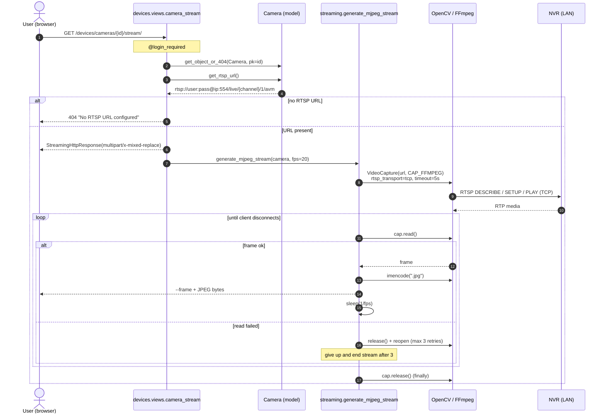
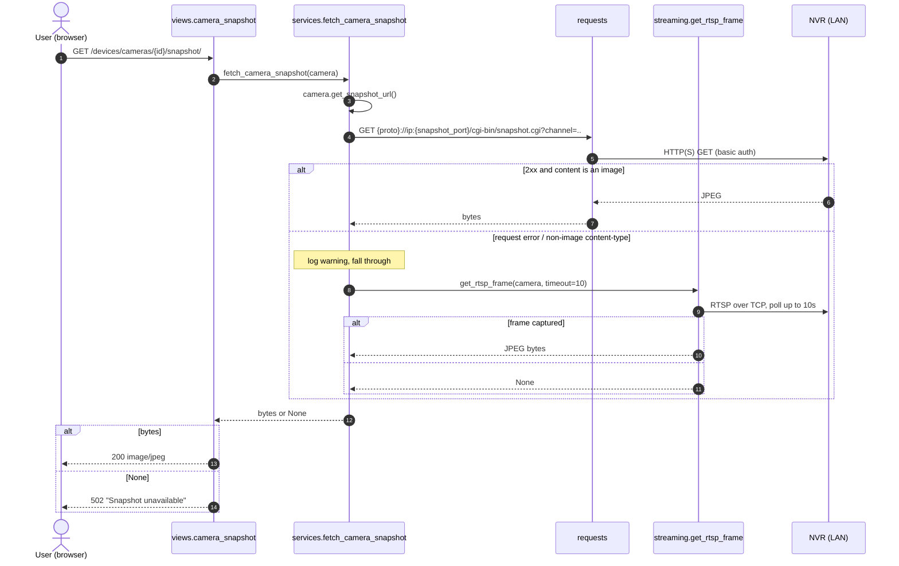
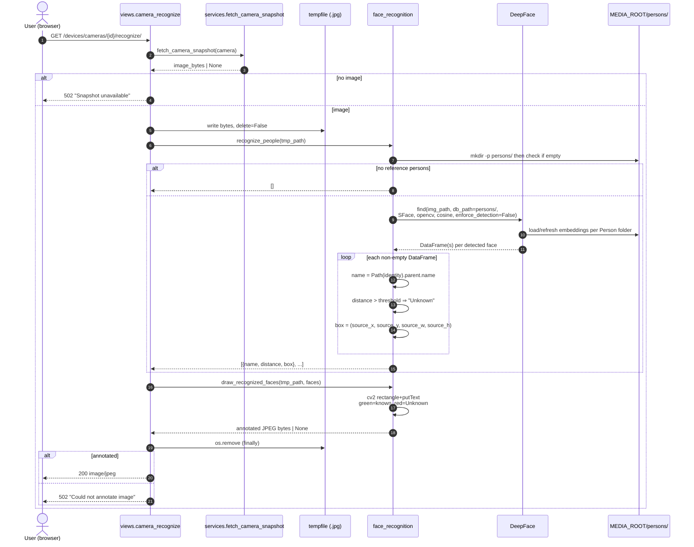
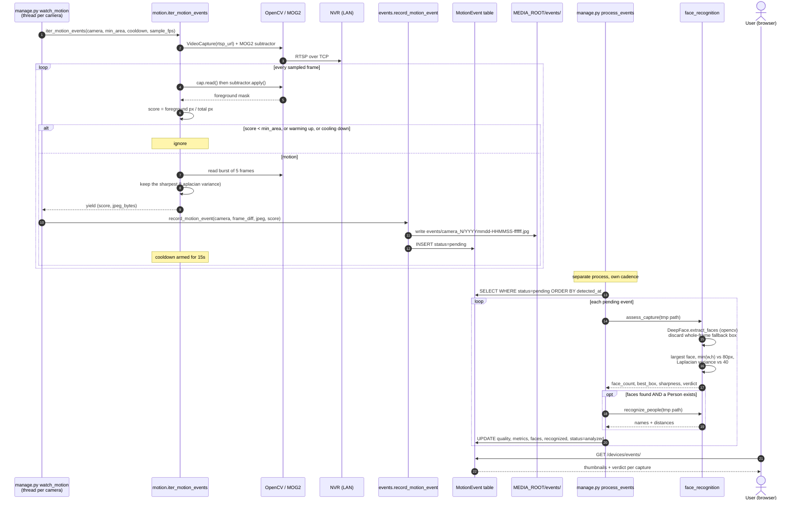
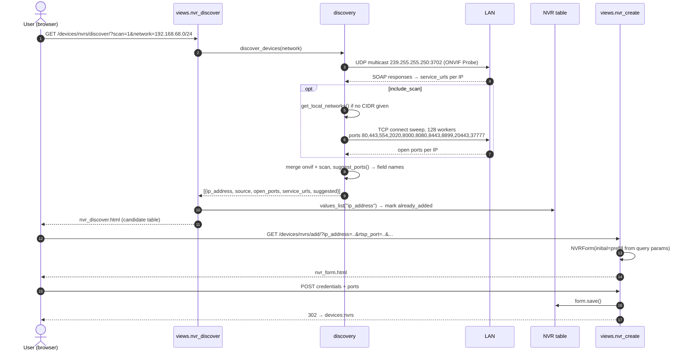
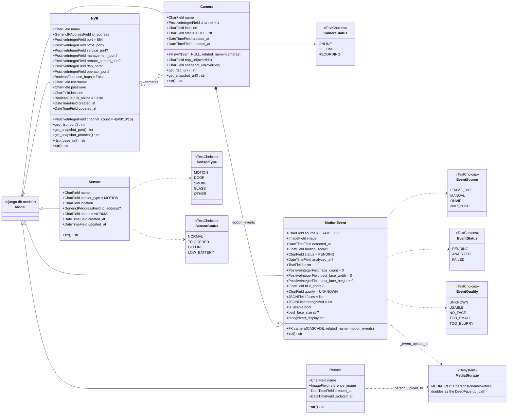
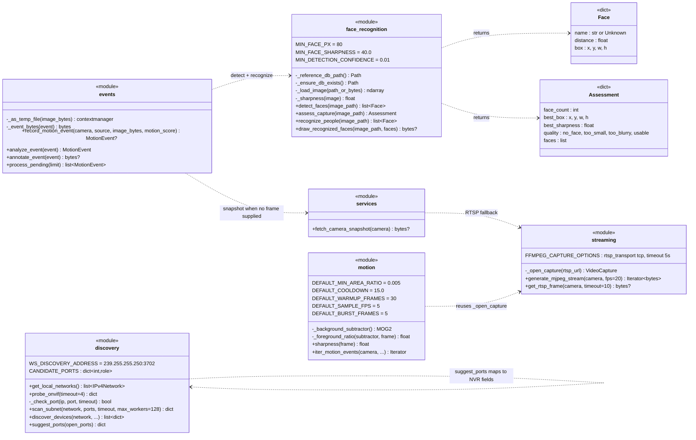

# Ride Security — Architecture

Diagrams describing the current state of the codebase. Mermaid syntax, renders on
GitHub and in most IDEs.

---

## 1. Component map

```mermaid
flowchart TB
    subgraph client["Client"]
        browser["Browser<br/>(templates/base.html + panels)"]
    end

    subgraph edge["Edge (optional)"]
        cf["cloudflared<br/>Cloudflare Tunnel<br/>profile: tunnel"]
    end

    subgraph web["Docker service: web — Django (config)"]
        urls["config/urls.py<br/>admin/ · accounts/ · devices/ · dashboard/"]

        subgraph accounts_app["accounts"]
            acc_views["UserLoginView<br/>UserLogoutView"]
        end

        subgraph dashboard_app["dashboard"]
            dash_views["home()<br/>aggregate counts"]
        end

        subgraph devices_app["devices"]
            dev_views["views.py<br/>camera / nvr / sensor CRUD<br/>feed · snapshot · stream · recognize<br/>event list / detail / capture"]
            dev_forms["forms.py<br/>NVRForm · CameraForm · SensorForm"]
            dev_models["models.py<br/>NVR · Camera · Sensor<br/>Person · MotionEvent"]
            dev_admin["admin.py<br/>Django admin (Person upload)"]
            discovery["discovery.py<br/>ONVIF WS-Discovery + TCP sweep"]
            services["services.py<br/>fetch_camera_snapshot()"]
            streaming["streaming.py<br/>generate_mjpeg_stream()<br/>get_rtsp_frame()"]
            facerec["face_recognition.py<br/>recognize_people()<br/>detect_faces() · assess_capture()<br/>draw_recognized_faces()"]
            motion["motion.py<br/>iter_motion_events()<br/>MOG2 frame diff + sharpest pick"]
            events["events.py<br/>record_motion_event()<br/>analyze_event() · process_pending()"]
            mgmt["management/commands<br/>discover_nvrs"]
        end
    end

    subgraph workers["Worker processes (compose profile: motion)"]
        watcher["manage.py watch_motion<br/>one thread per camera"]
        processor["manage.py process_events --loop<br/>deferred analysis"]
    end

    subgraph storage["Persistence (volumes)"]
        db[("SQLite<br/>db_data → /app/data")]
        media[("MEDIA_ROOT/persons/&lt;name&gt;/<br/>reference images = DeepFace db")]
        captures[("MEDIA_ROOT/events/camera_&lt;id&gt;/<br/>captured frames")]
        weights[("deepface_weights<br/>/root/.deepface")]
    end

    subgraph libs["Third-party runtime"]
        cv2["OpenCV + FFmpeg"]
        deepface["DeepFace (SFace, opencv detector)"]
        requests["requests"]
    end

    subgraph lan["LAN"]
        nvr_dev["NVR (TP-Link VIGI)<br/>RTSP 554 · HTTP snapshot"]
        cams["Cameras (PoE / WiFi)<br/>channels 1..N"]
        sensors_dev["Sensors<br/>(records only, no polling yet)"]
    end

    browser --> cf --> urls
    browser --> urls
    urls --> acc_views
    urls --> dash_views
    urls --> dev_views
    urls --> dev_admin

    dev_views --> dev_forms --> dev_models
    dev_views --> dev_models
    dash_views --> dev_models
    dev_admin --> dev_models
    dev_models --> db
    dev_admin -- "reference_image upload" --> media

    dev_views --> discovery
    dev_views --> services
    dev_views --> streaming
    dev_views --> facerec
    dev_views --> events
    mgmt --> discovery

    watcher --> motion
    watcher -- "record only" --> events
    processor -- "analyze pending" --> events
    motion --> cv2
    events --> facerec
    events --> services
    events --> dev_models
    events -- "store frame" --> captures

    services -- "HTTP snapshot" --> requests --> nvr_dev
    services -- "fallback single frame" --> streaming
    streaming --> cv2 -- "RTSP/TCP" --> nvr_dev
    facerec --> deepface
    deepface --> media
    deepface --> weights
    facerec --> cv2

    discovery -- "UDP 3702 multicast + TCP port scan" --> nvr_dev
    nvr_dev --> cams
    sensors_dev -.-> dev_models

    %% ---- palette: one colour per component type, all with dark text ----
    classDef default fill:#ffffff,stroke:#4b5563,color:#111827;
    classDef client fill:#dbeafe,stroke:#2563eb,color:#1e3a8a;
    classDef edge fill:#ffedd5,stroke:#ea580c,color:#7c2d12,stroke-dasharray: 4 3;
    classDef routing fill:#e0e7ff,stroke:#4f46e5,color:#312e81;
    classDef view fill:#dcfce7,stroke:#16a34a,color:#14532d;
    classDef form fill:#fef3c7,stroke:#d97706,color:#78350f;
    classDef model fill:#ede9fe,stroke:#7c3aed,color:#4c1d95;
    classDef service fill:#ccfbf1,stroke:#0d9488,color:#134e4a;
    classDef store fill:#e2e8f0,stroke:#475569,color:#0f172a;
    classDef lib fill:#fce7f3,stroke:#db2777,color:#831843;
    classDef device fill:#fee2e2,stroke:#dc2626,color:#7f1d1d,stroke-dasharray: 4 3;
    classDef worker fill:#cffafe,stroke:#0891b2,color:#164e63;

    class browser client;
    class cf edge;
    class urls routing;
    class acc_views,dash_views,dev_views,dev_admin view;
    class dev_forms form;
    class dev_models model;
    class discovery,services,streaming,facerec,motion,events,mgmt service;
    class watcher,processor worker;
    class db,media,captures,weights store;
    class cv2,deepface,requests lib;
    class nvr_dev,cams,sensors_dev device;

    style client fill:#f8fafc,stroke:#94a3b8,color:#0f172a;
    style edge fill:#f8fafc,stroke:#94a3b8,color:#0f172a;
    style web fill:#f8fafc,stroke:#94a3b8,color:#0f172a;
    style accounts_app fill:#ffffff,stroke:#cbd5e1,color:#0f172a;
    style dashboard_app fill:#ffffff,stroke:#cbd5e1,color:#0f172a;
    style devices_app fill:#ffffff,stroke:#cbd5e1,color:#0f172a;
    style storage fill:#f8fafc,stroke:#94a3b8,color:#0f172a;
    style libs fill:#f8fafc,stroke:#94a3b8,color:#0f172a;
    style lan fill:#f8fafc,stroke:#94a3b8,color:#0f172a;
    style workers fill:#f8fafc,stroke:#94a3b8,color:#0f172a;
```

**Legend**

| Colour | Component type | Nodes |
| --- | --- | --- |
| Blue | Client | browser |
| Orange (dashed) | Optional edge / external service | cloudflared |
| Indigo | URL routing | `config/urls.py` |
| Green | Views / controllers | app views, Django admin |
| Amber | Forms | `devices/forms.py` |
| Purple | Models (ORM) | `devices/models.py` |
| Teal | Service modules (I/O, no ORM) | discovery, services, streaming, face_recognition, motion, events, mgmt command |
| Cyan | Long-running worker processes | watch_motion, process_events |
| Slate | Persistence / volumes | SQLite, media, captures, DeepFace weights |
| Pink | Third-party runtime libs | OpenCV, DeepFace, requests |
| Red (dashed) | Physical LAN hardware | NVR, cameras, sensors |

**Notes on the current state**

- `Sensor` is persistence + UI only; nothing polls the physical sensors yet. Motion is
  detected in software from the RTSP stream, not from a `Sensor` row.
- Recognition never runs on the live stream. It runs on single frames, either on-demand
  (`/recognize/`) or against a stored `MotionEvent`.
- Capture and analysis are decoupled: `watch_motion` only writes rows, `process_events`
  analyses them. A `MotionEvent` is therefore `pending` for a while, by design.
- The DeepFace "database" is the `MEDIA_ROOT/persons/<name>/` directory tree created by
  `Person.reference_image` uploads — `Person` rows and the folder layout are coupled by
  `_person_upload_to`.
- `Person` has no frontend view; it is managed through Django admin only.
- The motion watcher opens its own RTSP connection per camera, independent of any browser
  viewing `/stream/`. Two viewers plus the watcher means three connections to the NVR.

---

## 2. Sequence diagrams

### 2.1 Live MJPEG stream

### 2.2 Snapshot with fallback

### 2.3 Face recognition on a snapshot

### 2.4 Motion → capture → deferred analysis

### 2.5 LAN discovery → add NVR

---

## 3. Class diagram

### Forms and views

```mermaid
classDiagram
    direction TB

    class ModelForm {
        <<django.forms>>
    }
    class NVRForm {
        Meta.model = NVR
        15 fields incl. all ports
        password → PasswordInput(render_value)
    }
    class CameraForm {
        Meta.model = Camera
        channel: TypedChoiceField(int)
        __init__() limits choices to nvr.channel_count (default 16)
    }
    class SensorForm {
        Meta.model = Sensor
        name, sensor_type, location, ip_address, status
    }
    ModelForm <|-- NVRForm
    ModelForm <|-- CameraForm
    ModelForm <|-- SensorForm

    class LoginView {
        <<django.contrib.auth.views>>
    }
    class LogoutView {
        <<django.contrib.auth.views>>
    }
    class UserLoginView {
        template_name = accounts/login.html
        redirect_authenticated_user = True
    }
    class UserLogoutView {
        next_page = accounts:login
    }
    LoginView <|-- UserLoginView
    LogoutView <|-- UserLogoutView

    class ModelAdmin {
        <<django.contrib.admin>>
    }
    class NVRAdmin {
        fieldsets: general + Ports
        get_snapshot_port() / get_rtsp_port() display
    }
    class CameraAdmin {
        fieldsets: general + Connection
    }
    class PersonAdmin
    class SensorAdmin
    ModelAdmin <|-- NVRAdmin
    ModelAdmin <|-- CameraAdmin
    ModelAdmin <|-- PersonAdmin
    ModelAdmin <|-- SensorAdmin
```

### Service modules (function-level, no classes)

---

## 4. URL surface

| Path | View | Purpose |
| --- | --- | --- |
| `/` | RedirectView | → `dashboard:home` |
| `/accounts/…` | `UserLoginView` / `UserLogoutView` | auth |
| `/dashboard/` | `dashboard.home` | counts + first 6 cameras/sensors, 4 NVRs |
| `/devices/cameras/` | `camera_list` | list |
| `/devices/cameras/add/`, `/{id}/edit/`, `/{id}/delete/` | `camera_*` | CRUD |
| `/devices/cameras/{id}/feed/` | `camera_feed` | page embedding the stream |
| `/devices/cameras/{id}/snapshot/` | `camera_snapshot` | JPEG proxy |
| `/devices/cameras/{id}/stream/` | `camera_stream` | MJPEG |
| `/devices/cameras/{id}/recognize/` | `camera_recognize` | annotated JPEG |
| `/devices/cameras/{id}/capture/` | `event_capture` | POST: capture + analyze now |
| `/devices/events/` | `event_list` | captures + quality verdicts |
| `/devices/events/{id}/` | `event_detail` | metrics, frame, annotated frame |
| `/devices/events/{id}/image/` | `event_image` | stored frame |
| `/devices/events/{id}/annotated/` | `event_annotated` | frame with face boxes |
| `/devices/events/{id}/analyze/` | `event_analyze` | POST: analyze now |
| `/devices/sensors/…` | `sensor_*` | CRUD |
| `/devices/nvrs/…` | `nvr_*` | CRUD |
| `/devices/nvrs/discover/` | `nvr_discover` | LAN scan |
| `/admin/` | Django admin | includes `Person` reference images and `MotionEvent` rows |

All device/dashboard views are `@login_required`.

---

## 5. Background commands

| Command | Purpose |
| --- | --- |
| `manage.py discover_nvrs [--network CIDR]` | one-shot LAN scan |
| `manage.py watch_motion [--camera ID] [--min-area] [--cooldown] [--sample-fps] [--analyze]` | long-running motion watcher, one thread per camera |
| `manage.py process_events [--limit N] [--loop] [--interval S]` | analyse pending captures |

`watch_motion` and `process_events` also exist as compose services behind the
`motion` profile: `docker compose --profile motion up -d`.
